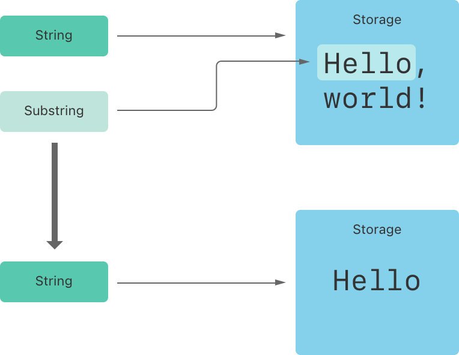

# 字符

可以通过 for 循环遍历字符串 从而获取每一个字符的值:

```swift
for i in "dog" {
  print(i)
}
```

可以通过声明一个字符类型并用字符字面量赋值 创建一个独立的字符常量或变量:

字符串可以通过传递一个值为字符的数组作为自变量来初始化:

```swift
let exclamationMark: Character = "!"
5 let catCharacters: [Character] = ["C", "a", "t", "!"]
6 let catString = String(catCharacters)
```

# 子字符串

当使用下标或者 `prefix(_:)` 之类的方法从字符串中获取一个子字符串

就可以得到一个 `Substring` 的实例，而非另外一个 `String`

`String` 和 `Substring` 都遵循 [`StringProtocol`](https://developer.apple.com/documentation/swift/stringprotocol) 协议，这意味着操作字符串的函数使用 `StringProtocol` 会更加方便。

Swift 里的 `Substring` 绝大部分函数都跟 `String` 一样

不同的是，它只能在短时间内需要操作字符串时使用

当需要长时间保存结果时，就需要把 `Substring` 转化为 `String` 以便长期存储：

```swift
let greeting = "Hello, world!"
let index = greeting.firstIndex(of: ",") ?? greeting.endIndex
let beginning = greeting[..<index]
// beginning 的值为 "Hello"

let newString = String(beginning)
```

 `Substring` 会像 `String`一样在内存里保存字符集

而 `String` 和 `Substring` 的区别在于性能优化上，`Substring` 可以重用原 `String` 的内存空间，或者另一个 `Substring` 的内存空间（`String` 也有同样的优化，但如果两个 `String` 共享内存的话，它们就会相等）。这一优化意味着你在修改 `String` 和 `Substring` 之前都不需要消耗性能去复制内存。

就 因为它重用了原 `String` 的内存空间，原 `String` 的内存空间必须保留直到它的 `Substring` 不再被使用为止。所以不适合长期存储

上面的例子，`greeting` 是一个 `String`，意味着它在内存里有一片空间保存字符集。而由于 `beginning` 是 `greeting` 的 `Substring`，它重用了 `greeting` 的内存空间。相反，`newString` 是一个 `String` —— 它是使用 `Substring` 创建的，拥有一片自己的内存空间。下面的图展示了他们之间的关系：



---

以上

