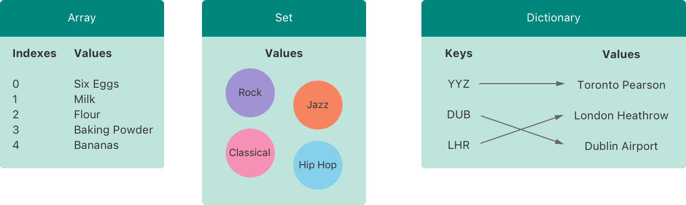

# 4.0-集合类型

Swift 语言提三种基本的*集合类型*用来存储集合数据

集合数据是可变的

核心是以泛型实现的

- 数组 `Element`是 有序的 可重复的 同类型的 有索引

- 集合  `Element`是 无序无重复的  同类型的 无索引

- 字典  `Element`是 无序无重复的 键值对`key: value`

## 1.关于元组

元组是数据不是数据类型 所以更不是集合类型