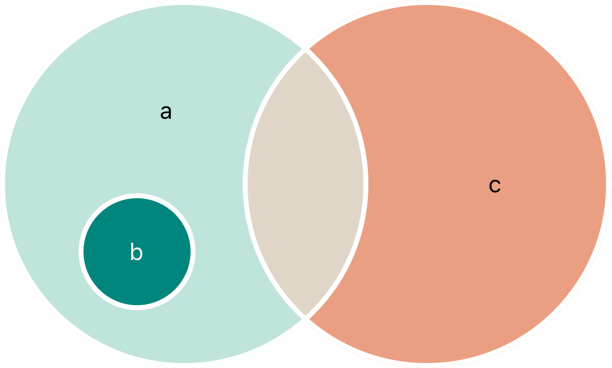

# 4.2-集合类型: 集合

`Set<Element>`,没有简写

无序/同类型/不可重复/无法指定的 一堆数据`<Element>`

必须遵循 `Hashable` 协议,即可哈希

因为无序,所以没有索引

被桥接到 Foundation 中的 `NSSet` 类

特性:方便进行集合运算

只能通过方法和属性对集合进行操作,要指定特定值

## 1.哈希

`Hsah`会比较是否重复

相等的对象哈希值必须相同，比如 `a == b`,因此必须 `a.hashValue == b.hashValue`

`Hash` 的本质就是一个 `function`

Swift 处理重复的 `hash`值会使用 Linear probing

Swift 的所有基本类型, `String`、`Int`、`Double` 和 `Bool`以及`enum`.默认都是可哈希化的

## 2.初始化

因为集合和数据使用的字面量写法一样,都是`[]`

所以合集类型无法被推断, 必须显式声明

### 声明空合集

使用构造语法声明空集合

根据上下文已经明确被推断类型

使用字面量声明空集合

```swift
var someInts<String>
var someInts = Set<String>()

letters.insert("a")
letters = []

var yq: Set<String> = []
var yq: Set<String> = ["抽烟", "喝酒", "烫头"]
var yq: Set = ["抽烟", "喝酒", "烫头"]
```

## 3.操作

### 属性

|          |      |
| -------- | ---- |
| .count   |      |
| .isEmpty |      |

### 方法

|               |                   |
| ------------- | ----------------- |
| .contains(_:) | 检查包含特定值    |
| .insert()     | 插入              |
| .sorted()     | 排序,便于遍历     |
| .update       | 无论是否有,都替换 |
| .filter()     | 条件查找          |

### 遍历

`for-in` 循环

因为无序,为了以特定的顺序遍历常使用 `.sorted()` 方法

```swift
for item in yq.sorted() {
  print(item)
}
```

### 从 Array 转换成 Set

用于清理数据

```swift
let array = []
let set = Set(array)
```

## 4.执行集合关系

### 基本集合操作关系

| **集合关系**             | **功能**                                                     |
| ------------------------ | ------------------------------------------------------------ |
| A == B                   | 方法,判断全等                                                |
| A.intersection(B)        | 方法,根据交集创建新集合。                                    |
| A.symmetricDifference(B) | 方法,根据不相交集创建新集合。                                |
| A.union(B)               | 方法,根据所有的值(A+B)创建新集合。                           |
| A.subtracting(B)         | 方法,根据不在另一个集合中的值(A-B)创建新集合。位置交换,结果会不一样 |


### 集合成员关系

| **集合成员关系**          | **功能**                                     |
| ------------------------- | -------------------------------------------- |
| A.isSubset(of: B)         | 方法,判断A是否为B的子集.A的所有值是否都在B里 |
| A.isSuperset(of: B)       | 方法,判断A是否为B的超集,A是否包含全部B的值   |
| A.isDisjoint(with: B)     | 方法,两个集合不相交为true                    |
| A.isStrictSubset(of: B)   | 方法,判断A是否是B的子集,且两个集合不相等     |
| A.isStrictSuperset(of: B) | 方法,判断A是否是B的父集,且两个集合不相等     |



```swift
import Foundation

let A: Set = ["🐶", "🐱"]
let B: Set = ["🐮", "🐔", "🐑", "🐶", "🐱"]
let C: Set = ["🐦", "🐭"]

print(A.intersection(B).sorted())
print(A.symmetricDifference(B).sorted())
print(A.union(B).sorted())
print(A.subtracting(B).sorted())
```

---

以上