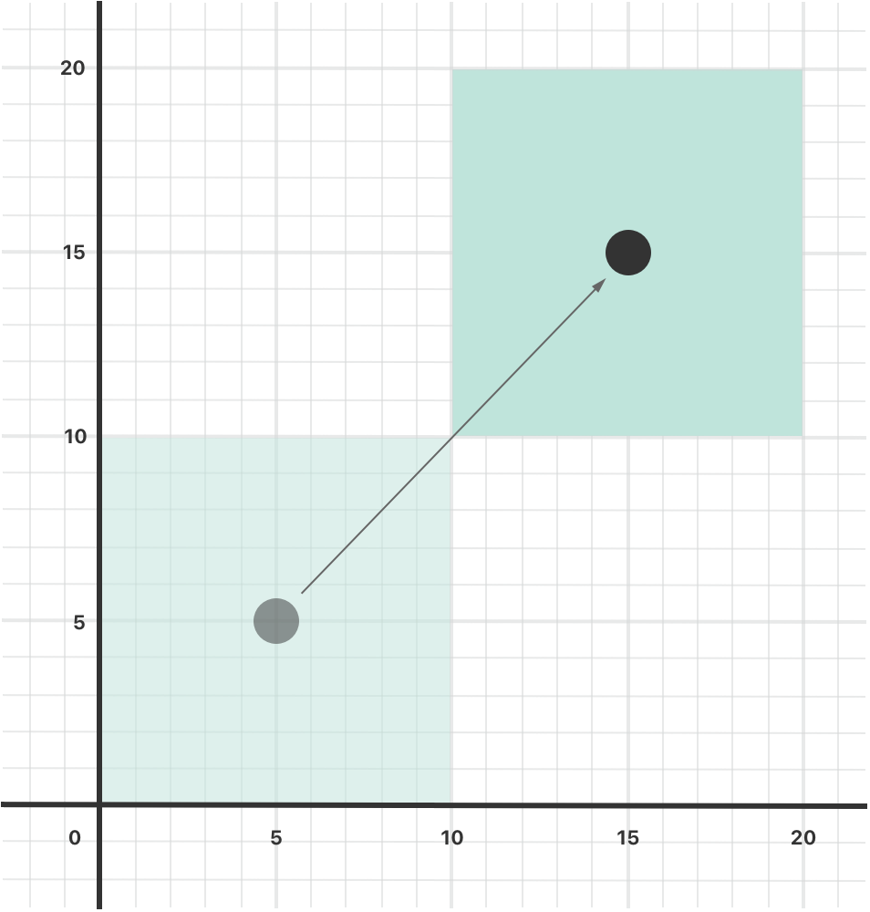

# 8.3-自定义数据类型: 属性

属性将值与特定的自定义数据类型关联。

存储属性会将常量和变量存储为实例的一部分，

而计算属性则是直接计算（而不是存储）值。

计算属性可以用于全部自定义数据类型，而存储属性枚举不能用。

存储属性和计算属性通常与特定类型的实例关联。但是，属性也可以直接与类型本身关联，这种属性称为类型属性。

另外，还可以定义属性观察器来监控属性值的变化，以此来触发自定义的操作。属性观察器可以添加到类本身定义的存储属性上，也可以添加到从父类继承的属性上。

你也可以利用属性包装器来复用多个属性的 getter 和 setter 中的代码。

## 1.存储属性

一个存储属性就是存储在特定类或结构体实例里的常量和变量。枚举不可用

存储属性可以指定默认值,也可以在构造过程中设置或修改存储属性的值，甚至修改常量存储属性的值

🌰:用结构体描述了一个整数区间 

`固定长度范围`是模型

`三个长度范围`是用模型创建的实例,

其中的`第一个值`和`长度`两个属性在实例化时初始化为具体的值

```swift
struct 固定长度范围 {
    var 第一个值: Int
    let 长度: Int
}
var 三个长度范围 = 固定长度范围(第一个值: 0, 长度: 3)
// 该区间表示整数 0，1，2
三个长度范围.第一个值 = 6
// 该区间现在表示整数 6，7，8
```

### 常量结构体实例的存储属性

一个常量结构体实例, 无法修改该实例的任何属性，即使被声明为可变属性也不行

这种行为是由于结构体属于值类型。当值类型的实例被声明为常量的时候，它的所有属性也就成了常量。

`四个长度范围`被实例化为常量 ,尽管`第一个值`是个可变属性，但如果更改它还是会报错

```swift
let 四个长度范围 = 固定长度范围(第一个值: 0, 长度: 4)
// 该区间表示整数 0，1，2，3
四个长度范围.第一个值 = 6
```

### 延时加载存储属性

关键字 `lazy`

是当第一次被调用的时候才会计算其初始值的属性

必须声明成变量`var`,因为属性的初始值可能在实例构造完成之后才会得到.常量属性在构造过程完成之前必须要有初始值，因此无法声明成延时加载。

应用场景:

- 当属性的值依赖于一些外部因素且这些外部因素只有在构造过程结束之后才会知道的时候
- 当获得属性的值因为需要复杂或者大量的计算，而需要采用需要的时候再计算的方式

如果一个被标记为 `lazy` 的属性在没有初始化时就同时被多个线程访问，则无法保证该属性只会被初始化一次。

🌰:

下面的例子使用了延时加载存储属性来避免复杂类中不必要的初始化工作。例子中定义了 `DataImporter` 和 `DataManager` 两个类，下面是部分代码：

```swift
class DataImporter {
    /*
    DataImporter 是一个负责将外部文件中的数据导入的类。
    这个类的初始化会消耗不少时间。
    */
    var fileName = "data.txt"
    // 这里会提供数据导入功能
}

class DataManager {
    lazy var importer = DataImporter()
    var data: [String] = []
    // 这里会提供数据管理功能
}

let manager = DataManager()
manager.data.append("Some data")
manager.data.append("Some more data")
// DataImporter 实例的 importer 属性还没有被创建
```

`DataManager` 类包含一个名为 `data` 的存储属性，初始值是一个空的字符串数组。这里没有给出全部代码，只需知道 `DataManager` 类的目的是管理和提供对这个字符串数组的访问即可。

`DataManager` 的一个功能是从文件中导入数据。这个功能由 `DataImporter` 类提供，`DataImporter` 完成初始化需要消耗不少时间：因为它的实例在初始化时可能需要打开文件并读取文件中的内容到内存中。

`DataManager` 管理数据时也可能不从文件中导入数据。所以当 `DataManager` 的实例被创建时，没必要创建一个 `DataImporter` 的实例，更明智的做法是第一次用到 `DataImporter` 的时候才去创建它。

由于使用了 `lazy`，`DataImporter` 的实例 `importer` 属性只有在第一次被访问的时候才被创建。比如访问它的属性 `fileName` 时：

```swift
print(manager.importer.fileName)
// DataImporter 实例的 importer 属性现在被创建了
// 输出“data.txt”
```

### 存储属性和实例变量

Swift 中的属性没有对应的实例变量，属性的备份存储也无法直接访问。

属性的全部信息——包括命名、类型和内存管理特征——作为类型定义的一部分，都定义在一个地方。

## 2.计算属性

计算属性不直接存储值,而是提供一个 `getter `和一个可选的 `setter`

通过计算 来间接获取和设置其他属性或变量的值

计算属性必须使用变量`var`定义，包括只读计算属性，因为它们的值不是固定的

```swift
struct Point {
    var x = 0.0, y = 0.0
}
struct Size {
    var width = 0.0, height = 0.0
}
struct Rect {
    var origin = Point()
    var size = Size()
    var center: Point {
        get {
            let centerX = origin.x + (size.width / 2)
            let centerY = origin.y + (size.height / 2)
            return Point(x: centerX, y: centerY)
        }
        set(newCenter) {
            origin.x = newCenter.x - (size.width / 2)
            origin.y = newCenter.y - (size.height / 2)
        }
    }
}
var square = Rect(origin: Point(x: 0.0, y: 0.0),
    size: Size(width: 10.0, height: 10.0))
let initialSquareCenter = square.center
// initialSquareCenter 位于（5.0， 5.0）
square.center = Point(x: 15.0, y: 15.0)
print("square.origin is now at (\(square.origin.x), \(square.origin.y))")
// 打印“square.origin is now at (10.0, 10.0)”
```

这个例子定义了 3 个结构体来描述几何形状：

- `Point` 封装了一个 `(x, y)` 的坐标
- `Size` 封装了一个 `width` 和一个 `height`
- `Rect` 表示一个有原点和尺寸的矩形

`Rect` 也提供了一个名为 `center` 的计算属性。一个 `Rect` 的中心点可以从 `origin`（原点）和 `size`（大小）算出，所以不需要将中心点以 `Point` 类型的值来保存。`Rect` 的计算属性 `center` 提供了自定义的 getter 和 setter 来获取和设置矩形的中心点，就像它有一个存储属性一样。

上述例子中创建了一个名为 `square` 的 `Rect` 实例，初始值原点是 `(0, 0)`，宽度高度都是 `10`。如下图中蓝色正方形所示。

`square` 的 `center` 属性可以通过点运算符（`square.center`）来访问，这会调用该属性的 getter 来获取它的值。跟直接返回已经存在的值不同，getter 实际上通过计算然后返回一个新的 `Point` 来表示 `square` 的中心点。如代码所示，它正确返回了中心点 `(5, 5)`。

`center` 属性之后被设置了一个新的值 `(15, 15)`，表示向右上方移动正方形到如下图橙色正方形所示的位置。设置属性 `center` 的值会调用它的 setter 来修改属性 `origin` 的 `x` 和 `y` 的值，从而实现移动正方形到新的位置。

### 简化

简化 Setter 声明

如果计算属性的 `setter` 没有定义表示新值的参数名，则可以使用默认名称 `newValue`

```swift
struct AlternativeRect {
    var origin = Point()
    var size = Size()
    var center: Point {
        get {
            let centerX = origin.x + (size.width / 2)
            let centerY = origin.y + (size.height / 2)
            return Point(x: centerX, y: centerY)
        }
        set {
            origin.x = newValue.x - (size.width / 2)
            origin.y = newValue.y - (size.height / 2)
        }
    }
}
```

简化 Getter 声明

如果整个 `getter` 是单一表达式，`getter` 会隐式地返回这个表达式结果

在` getter` 中忽略 `return`与在函数中忽略 `return`的规则相同

```swift
struct CompactRect {
    var origin = Point()
    var size = Size()
    var center: Point {
        get {
            Point(x: origin.x + (size.width / 2),
                  y: origin.y + (size.height / 2))
        }
        set {
            origin.x = newValue.x - (size.width / 2)
            origin.y = newValue.y - (size.height / 2)
        }
    }
}
```

### 只读计算属性

只有` getter` 没有` setter` 的计算属性叫只读计算属性

只读计算属性总是返回一个值，可以访问不能更改

只读计算属性的声明可以去掉 `get`关键字和花括号

```swift
struct Cuboid {
    var width = 0.0, height = 0.0, depth = 0.0
    var volume: Double {
    	return width * height * depth
    }
}
let fourByFiveByTwo = Cuboid(width: 4.0, height: 5.0, depth: 2.0)
print("the volume of fourByFiveByTwo is \(fourByFiveByTwo.volume)")
// 打印“the volume of fourByFiveByTwo is 40.0”
```

这个例子定义了一个名为 `Cuboid` 的结构体，表示三维空间的立方体，包含 `width`、`height` 和 `depth` 属性。结构体还有一个名为 `volume` 的只读计算属性用来返回立方体的体积。为 `volume` 提供 setter 毫无意义，因为无法确定如何修改 `width`、`height` 和 `depth` 三者的值来匹配新的 `volume`。然而，`Cuboid` 提供一个只读计算属性来让外部用户直接获取体积是很有用的。

## 3.属性观察器

属性观察器监控和响应属性值的变化，触发自定义的操作, 每次属性被设置值的时候都会调用属性观察器，即使新值和当前值相同的时候也不例外

可以在以下位置添加属性观察器：

- 自定义的存储属性
- 继承的存储属性
- 继承的计算属性

对于继承的属性，可以在子类中通过重写属性的方式为它添加属性观察器。

对于自定义的计算属性，使用它的 setter 监控和响应值的变化，而不是尝试创建观察器


可以为属性添加其中一个或两个观察器：

- `willSet` 在新的值被设置之前调用
- `didSet` 在新的值被设置之后调用

`willSet` 观察器会将新的属性值作为常量参数传入，在 `willSet` 的实现代码中可以为这个参数指定一个名称，如果不指定则参数仍然可用，这时使用默认名称 `newValue` 表示。

`didSet` 观察器会将旧的属性值作为参数传入，可以为该参数指定一个名称或者使用默认参数名 `oldValue`。如果在 `didSet` 方法中再次对该属性赋值，那么新值会覆盖旧的值。

在父类初始化方法调用之后，在子类构造器中给父类的属性赋值时，会调用父类属性的 `willSet` 和 `didSet` 观察器。而在父类初始化方法调用之前，给子类的属性赋值时不会调用子类属性的观察器。

如果将带有观察器的属性通过 `in-out `方式传入函数，属性观察器同样会被调用

🌰:

下面的例子定义了一个名为 `StepCounter` 的类，用来统计一个人步行时的总步数。

```swift
class StepCounter {
    var totalSteps: Int = 0 {
        willSet(newTotalSteps) {
            print("将 totalSteps 的值设置为 \(newTotalSteps)")
        }
        didSet {
            if totalSteps > oldValue  {
                print("增加了 \(totalSteps - oldValue) 步")
            }
        }
    }
}
let stepCounter = StepCounter()
stepCounter.totalSteps = 200
// 将 totalSteps 的值设置为 200
// 增加了 200 步
stepCounter.totalSteps = 360
// 将 totalSteps 的值设置为 360
// 增加了 160 步
stepCounter.totalSteps = 896
// 将 totalSteps 的值设置为 896
// 增加了 536 步
```

`StepCounter` 类定义了一个叫 `totalSteps` 的 `Int` 类型的属性。它是一个存储属性，包含 `willSet` 和 `didSet` 观察器。

当 `totalSteps` 被设置新值的时候，它的 `willSet` 和 `didSet` 观察器都会被调用，即使新值和当前值完全相同时也会被调用。

例子中的 `willSet` 观察器将表示新值的参数自定义为 `newTotalSteps`，这个观察器只是简单的将新的值输出。

`didSet` 观察器在 `totalSteps` 的值改变后被调用，它把新值和旧值进行对比，如果总步数增加了，就输出一个消息表示增加了多少步。`didSet` 没有为旧值提供自定义名称，所以默认值 `oldValue` 表示旧值的参数名

## 4.属性包装器

定义属性的代码 和 管理属性如何存储 之间的分隔层。

复用多个属性的` getter` 和 `setter `中的代码

适用类结构体或枚举

### 定义属性包装器

关键词 `@wrappedValue`

```swift
@propertyWrapper
struct 最多报销一百块 {
	private var number = 0
	var wrappedValue: Int {
		get { return number }
		set { number = min(newValue, 100) }
	}
}
```

### 使用属性包装器

在属性之前写上包装器名称，就可以把一个包装器应用到一个属性上去

```swift
import UIKit
import Foundation

@propertyWrapper
struct 最多报销一百块 {
	private var 实际报销金额 = 0
	var wrappedValue: Int {
		get { return 实际报销金额 }
		set { 实际报销金额 = min(newValue, 100) }
	}
}

struct 每天花销 {
	@最多报销一百块 var 早餐: Int
	@最多报销一百块 var 午餐: Int
	@最多报销一百块 var 晚餐: Int
}

var 今天 = 每天花销()
print(今天.早餐)

今天.午餐 = 50
print(今天.午餐)

今天.晚餐 = 300
print(今天.晚餐)

/*
 早餐午餐晚餐属性从 最多报销一百块 的定义中获它们的初始值
	该定义把 最多报销一百块.报销金额 设置默认为0,所以不输入值,就是默认的0
	午餐输入的是50,存储成过,报销50
	晚餐的300,对于这个属性的 setter 的规则来说,超过了设定上限100,所以大于100的都报销100
 */
```

### 设置被包装属性的初始值

上面的例子中,代码通过 最多报销一百块 内的定义中赋值 报销金额 的初始值,作为被包装属性的初始值.

所以当使用了这个包装器的代码,就无法指定其初始值,想要让其支持设定初始值或其他自定义操作,需要添加一个新的构造器.以下是更新后的 最多报销一百块 扩展版本

当你包装器应用于属性且没有设定初始值时，Swift 使用 `init()`构造器来设置包装器。

当你属性指定初始值时，Swift 使用 `init(wrappedValue:)`构造器来设置包装器。

当你在自定义特性后面把实参写在括号里时，Swift 使用接受这些实参的构造器来设置包装器。

通过将实参包含到属性包装器中，你可以设置包装器的初始状态，或者在创建包装器时传递其他的选项。这种语法是使用属性包装器最通用的方法。你可以为这个属性提供任何所需的实参，且它们将被传递给构造器。

当包含属性包装器实参时，你也可以使用赋值来指定初始值。Swift 将赋值视为 `wrappedValue` 参数，且使用接受被包含的实参的构造器。

### 从属性包装器中呈现一个值

除了被包装值，属性包装器可以通过定义被呈现值暴露出其他功能。

属性包装器可以返回任何类型的值作为它的被呈现值。

## 5.类型属性

为类型本身定义属性，无论创建了多少个该类型的实例，这些属性都只有唯一一份。这种属性就是*类型属性*。

关键字 `static` 来定义类型属性

## 6.操作类型属性

类型属性也是通过点运算符来访问。但是，类型属性是通过*类型*本身来访问，而不是通过实例。

```swift
print(SomeStructure.xxx)
```

